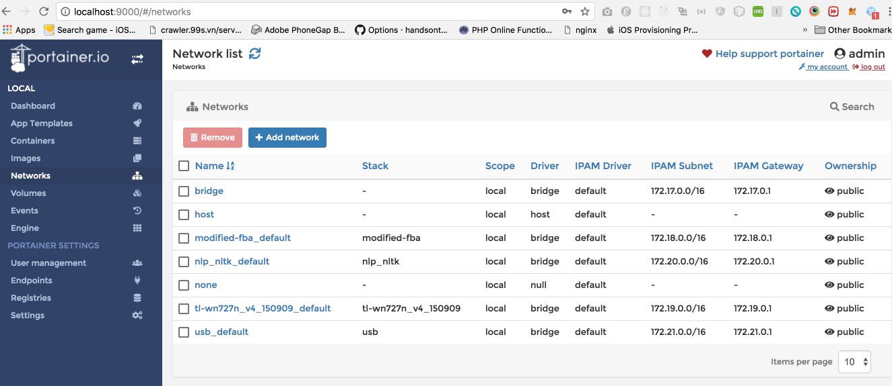
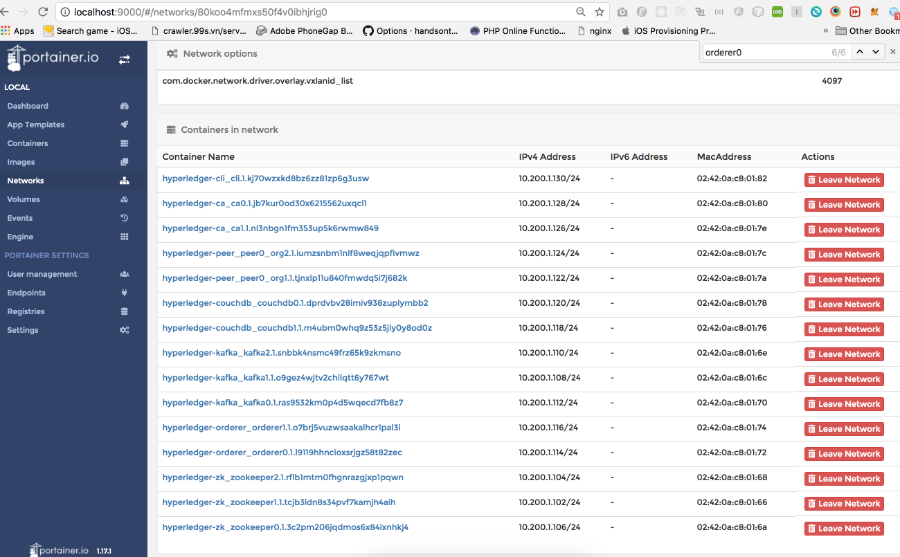
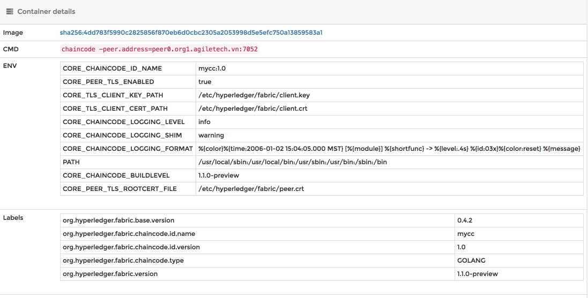

# hyperledger_on_swarm

* clone this git

```
  cd hyperledger-fabric-swarm
  git clone https://github.com/blockchainvn/hyperledger-fabric-swarm.git
```

# portainer

```
  yarn portainer
```

Open url: http://localhost:9000


# build tools

```
  yarn build-tools
```

This repository is for deploying Hyperledger Fabric on Swarm cluster easily.

* Supported version : 1.0.2 and above (1.1.0 currently)

- You can specify number of each component. Supported components are:

  * Number of Organizations (CA will be one per a Organization)
  * Number of Peer per a Organization
  * Number of Orderer
  * Number of Kafka
  * Number of Zookeeper
  * Domain name

## Instructions

### Pre-reqs

* 1 or more machines with Linux
* Install Docker >= 1.13

### [Create Docker Swarm cluster](https://docs.docker.com/engine/swarm/swarm-tutorial/)

* Create one or more master hosts and other worker hosts
  * Open ports for Swarm. On ALL hosts, (eg, CentOS)

```
  # if run on local, no need
  firewall-cmd --permanent --zone=public --add-port=2377/tcp --add-port=7946/tcp --add-port=7946/udp --add-port=4789/udp
  firewall-cmd --reload
```

* I think opening swarm ports only is sufficient because all nodes communicates thru overlay network.

- on master host,

```
  docker swarm init
```

* You can see like below,

```
  Swarm initialized: current node (dxn1zf6l61qsb1josjja83ngz) is now a manager.

  To add a worker to this swarm, run the following command:

    docker swarm join --token SWMTKN-1-0q7mhbliu4lp7lehsavwzkv2di8214bvp7d29d33zxbbn6gm88-dz9bdw752l2296ni4ia2nsudk 192.168.65.3:2377

  To add a manager to this swarm, run 'docker swarm join-token manager' and follow the instructions.
```

* Use last command to join worker host to Swarm cluster
  eg, on worker hosts,

```
    docker swarm join --token SWMTKN-1-0q7mhbliu4lp7lehsavwzkv2di8214bvp7d29d33zxbbn6gm88-dz9bdw752l2296ni4ia2nsudk 192.168.65.3:2377
```

### Create overlay network

* Create overlay network which will be used as path between hyperledger nodes
  * on Master host,

```
    docker network create --attachable --driver overlay --subnet=10.200.1.0/24 hyperledger-ov
```

### Get Hyperledger Fabric artifacts and binaries

* As encryption keys and artifacts share same path, you need to put them on same location.
  * In this case, the location is '/nfs-share' (I personally use NFS)
  * For example,

```
  $ mount 1.2.3.4:/nfs-share $PWD
  $ ls
  channel-artifacts crypto-config
```

### Generate the artifacts

* generate config file for your own configuration. For example,

```
  yarn genConfig -domain agiletech.vn -Kafka 3 -Orderer 2 -Zookeeper 3 -Orgs 2 -Peer 1 -Tag :x86_64-1.1.0-preview
```

For information,

```
  yarn genConfig -h > /dev/null
```

* generate artifacts

```
  yarn genArtifacts -c <CHANNEL-NAME> -d <DOMAIN-NAME> -o <NUM-ORGS>
```

For example,

```
  yarn genArtifacts -c mychannel -d agiletech.vn -o 2
```

* share two directories (channel-artifacts, crypto-config) among all hosts with same path, let's assume at **1.2.3.4:/nfs-share**

### Deploy Hyperledger Fabric nodes

* On Master host,
  * If you choose to configure with multiple orderers,

```
  yarn start
```

* If you choose to configure in 'solo' mode (without kafka, zookeeper)

```
  yarn start-solo
```

* I recommend you to check services' status after every deploy.

```
  docker service ls
```

go to http://localhost:9000/#/networks/<network_id> and you can see


* If something is wrong, check it, remove the stack, correct it and re-deploy.
* In case you want to check if network is OK or ports are opened on containers, you can use busybox. busybox has ping, telnet, etc.

```
  docker stack deploy -c busybox.yaml busybox
```

### Do the rest of [Getting Started of Hyperledger Fabric Documentation](https://hyperledger-fabric.readthedocs.io/en/latest/getting_started.html)

* Create & Join channel, Install, Instantiate & Query chaincodes
  * NOTE: environment variables & orderer's name should be corrected to work properly.

#### Examples

* Generate Hyperledger Fabric config

```
  yarn genConfig -domain agiletech.vn -Kafka 3 -Orderer 2 -Zookeeper 3 -Orgs 2 -Peer 2
```

* Generate artifacts

```
  yarn genArtifacts -c mychannel -d agiletech.vn -o 2
```

* Deploy Hyperledger Fabric

```
  yarn start
```

* Attach to cli container

```
  docker exec -it $(docker ps --format "table {{.ID}}" -f "label=com.docker.stack.namespace=hyperledger-cli" | tail -1) bash
```

* Create a channel

```
  export CHANNEL_NAME=mychannel
  export ORG=agiletech.vn
  peer channel create -o orderer0.${ORG}:7050 -c $CHANNEL_NAME -f ./channel-artifacts/channel.tx --tls true --cafile /opt/gopath/src/github.com/hyperledger/fabric/peer/crypto/ordererOrganizations/$ORG/orderers/orderer0.${ORG}/msp/tlscacerts/tlsca.${ORG}-cert.pem
```

* Join a channel

```
  peer channel join -b mychannel.block
  peer channel list
```

* Install & Initiate Chaincode

```
  peer chaincode install -n mycc -v 1.0 -p github.com/hyperledger/fabric/examples/chaincode/go/sacc
  peer chaincode instantiate -o orderer0.agiletech.vn:7050 --tls true --cafile /opt/gopath/src/github.com/hyperledger/fabric/peer/crypto/ordererOrganizations/agiletech.vn/orderers/orderer0.agiletech.vn/msp/tlscacerts/tlsca.agiletech.vn-cert.pem -C $CHANNEL_NAME -n mycc -v 1.0 -c '{"Args":["a", "100"]}'
```

if success you must see new chaincode container:


* Query & Invoke Chaincode

```
  peer chaincode query -C $CHANNEL_NAME -n mycc -c '{"Args":["query","a"]}'
  peer chaincode invoke -o orderer1.agiletech.vn:7050 --tls true --cafile /opt/gopath/src/github.com/hyperledger/fabric/peer/crypto/ordererOrganizations/agiletech.vn/orderers/orderer1.agiletech.vn/msp/tlscacerts/tlsca.agiletech.vn-cert.pem -C $CHANNEL_NAME -n mycc -c '{"Args":["set","a","10"]}'
  peer chaincode query -C $CHANNEL_NAME -n mycc -c '{"Args":["query","a"]}'
```
